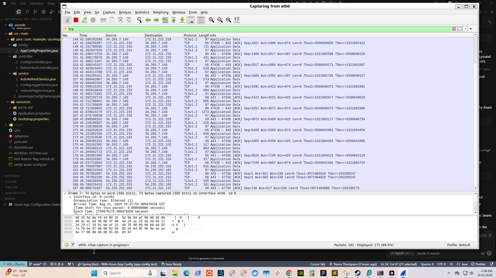

# Azure App Configuration Demo

A Spring Boot application testing dynamic configuration management using Azure App Configuration service.

## Features

- REST API endpoints to retrieve dynamic configuration values
- Attempting Automatic refresh of configuration without application restart
- Integration with Spring Cloud Azure
- Health check endpoints
- Support for feature flags - requires http requests to trigger refresh

## Prerequisites

- Java 17 or higher
- Maven 3.6+
- Azure subscription
- Azure App Configuration resource

## Azure App Configuration Setup

### 1. Create Azure App Configuration Resource

```bash
# Create resource group (if not exists)
az group create --name myResourceGroup --location "East US"

# Create App Configuration store
az appconfig create --resource-group myResourceGroup --name myAppConfigStore --location "East US" --sku free
```

### 2. Add Configuration Keys

Add the following key-value pairs to your Azure App Configuration:

| Key | Value | Content Type |
|-----|-------|--------------|
| `app.message` | `Hello from Azure App Configuration!` | text/plain |
| `app.feature.enabled` | `true` | text/plain |

You can add these through Azure portal or using Azure CLI:

```bash
# Add configuration values
az appconfig kv set --name myAppConfigStore --key "/application/app.message" --value "Hello from Azure App Configuration!"
az appconfig kv set --name myAppConfigStore --key "/application/app.feature.enabled" --value "true"
```

### 3. Get Connection Details

Get your App Configuration endpoint:

```bash
az appconfig show --name myAppConfigStore --resource-group myResourceGroup --query endpoint --output tsv
```

## Configuration

### Option 1: Using Environment Variables

Set the following environment variables:

```bash
export AZURE_APP_CONFIG_ENDPOINT="https://your-app-config-name.azconfig.io"
```

### Option 2: Using Connection String

Alternatively, you can use a connection string:

```bash
# Get connection string
az appconfig credential list --name myAppConfigStore --resource-group myResourceGroup

export AZURE_APP_CONFIG_CONNECTION_STRING="your-connection-string-here"
```

Then update `application.properties` to use connection string instead of endpoint:

```properties
spring.cloud.azure.appconfiguration.stores[0].connection-string=${AZURE_APP_CONFIG_CONNECTION_STRING}
```

### Get Configuration Message

```bash
GET http://localhost:8080/api/message
```

Response:
```json
{
  "message": "Hello from Azure App Configuration!",
  "featureEnabled": true,
  "timestamp": "2023-12-07T10:30:45.123",
  "source": "Azure App Configuration"
}
```


## Testing Dynamic Updates

See https://microsoft.github.io/spring-cloud-azure/docs/azure-app-configuration/2.6.0/reference/html/index.html#pull-based-refresh


The logConfigMessage() in the ConfigLoggerService.java logs the AppConfigProperties.java every 3 seconds.  Auto polling of the Azure App Config should detect property changes and inform the app to refresh the @RefreshScope AppConfigProperties Bean.  This should be reflecting in the logging if successful.  This is attempting to update the properties of a spring bean without a manual refresh of spring beans or any other http request.

1. **Start the application**
2. **Call the API:** `curl http://localhost:8080/api/message`
3. **Update the value in Azure App Configuration:**
   ```bash
   az appconfig kv set --name app-config-test-resource1 --key "/application/app.message" --value "Updated message from Azure!"
   ```
4. **Call the API again** to see the updated value

# Issue With Dynamic Updates with Polling

The auto-refresh from polling to Azure App Config is not working.  This means the app is not polling the Azure App Config every second for property updates with this : `spring.cloud.azure.appconfiguration.stores[0].monitoring.refresh-interval=2s`

Wireshark monitoring indicates there's no network traffic every second which indicates the polling every 2s specified in the monitoring.refresh-interval is not occurring :



## Work around solution for auto-refresh

- Use Azure Event Hub for a push model
- Just restart the app to pickup the latest property value from Azure App Config
- The AutoRefreshService.java presents another alternative but refreshing spring beans like this could impact performance.


## Environment-Specific Configuration

Use labels in Azure App Configuration for environment-specific values:

```bash
# Add environment-specific values
az appconfig kv set --name myAppConfigStore --key "/application/app.message" --value "Development message" --label "dev"
az appconfig kv set --name myAppConfigStore --key "/application/app.message" --value "Production message" --label "prod"

# Create keys with the default /application/ prefix
az appconfig kv set --name app-config-test-resource1 --key "/application/app.message" --value "Hello from Azure App Configuration!" --yes

az appconfig kv set --name app-config-test-resource1 --key "/application/app.feature.enabled" --value "true" --yes

az appconfig kv set --name app-config-test-resource1 --key "/application/app.version" --value "2.0.0-azure" --yes

az appconfig kv set --name app-config-test-resource1 --key "/application/app.environment" --value "azure" --yes

# Keep the sentinel key for refresh triggers
az appconfig kv set --name app-config-test-resource1 --key "sentinel" --value "1" --yes
```


